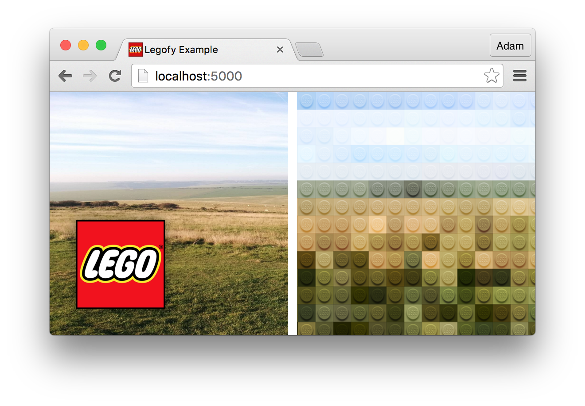

# Legofy

> Based entirely on [the Python implementation](https://github.com/JuanPotato/Legofy).


&nbsp;

&nbsp;

&nbsp;
[](http://legofy.herokuapp.com/)

* **npm:** `npm install legofy --save`
 **See:** [`angular-legofy`]().



## Getting Started

Simply `import` the `transform` function from the Legofy module, and then invoke it by passing in your `img` element.

```javascript
import {transform} from 'legofy';

// ...

const imgElement = document.querySelector('img');
transform(imgElement);
```

## Options

### Brick Size

You can adjust the size of the bricks by using the second argument of the `transform` function &mdash; by default the `factor` is `0.05`.

```javascript
// ...

// Make the bricks twice the size of the default.
transform(imgElement, { factor: 0.1 });

// ...Or make them twice as small!
transform(imgElement, { factor: 0.025 });
```

As the brick isn't currently SVG &mdash; [see ticket](https://github.com/Wildhoney/Legofy/issues/5) &mdash; larger bricks will look blurry.

### Blend Mode

You can also change the `mix-blend-mode` value using the second argument &mdash; the default is `overlay` however `screen`, `darken`, `color-burn`, `hard-light`, `soft-light` all look good as blend modes.

```javascript
// ...

// Change bricks to a more pastel colour.
transform(imgElement, { blendMode: 'screen' });
```

## Re-rendering

By default when the window is resized no re-rendering will occur &mdash; it's entirely up to the developer to invoke `transform` again &ndash; and thankfully the `transform` function is idempotent.

```javascript
import {throttle} from 'lodash';
import {transform} from 'legofy';

// ...

const imgElement = document.querySelector('img');
transform(imgElement);

//  ...
addEventListener('resize', throttle(() => transform(imgElement), 250));
```

## Browser Support


<sub><sup>Tested with Chrome 46.0, Firefox 42.0, Safari 9.0.1, Opera 33.0.</sup></sub>
